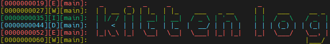

# Kitten Log


## Language
[中文](./readme_cn.md)

## Overview
A small and portable logging library for embedded systems.

Kitten Log provides a simple logging API with multiple log levels, formatted messages, optional timestamps, colored output, and an application-provided output hook.

## Features
- Lightweight C implementation
- No dynamic memory allocation
- Four log levels:
  - Debug
  - Info
  - Warning
  - Error
- `printf` style formatted messages
- Optional millisecond or second timestamps
- ANSI color codes for log levels
- Independent of UART, USB, or other transport implementations
- Suitable for UART, USB CDC, semihosting, or other output devices

## Package Contents
- `kitten_log.h`: Public API and configuration macros
- `kitten_log.c`: Core implementation

## Quick Start
Kitten Log contains only the core logging implementation. It does not provide a hardware-specific output driver. The application must provide the output function.

### 1. Add the source files
Add `kitten_log.c` to your build system and add the directory containing `kitten_log.h` to the include path.

### 2. Implement the output function
The application must implement `platform_kitten_log_print()`.

```c
#include "kitten_log.h"

void platform_kitten_log_print(const char *text, unsigned int length)
{
    /*
    * Send exactly `length` bytes to UART, USB CDC, semihosting,
    * a file, or another output device.
    */
}
```

The `length` parameter specifies the number of bytes to transmit. It does not include the terminating null byte (`'\0'`). The output function should transmit exactly `length` bytes.

### 3. Use the logging macros
```c
#include "kitten_log.h"

KITTEN_LOGE("main", "this is an error msg");
KITTEN_LOGW("main", "this is a warning msg");
KITTEN_LOGI("main", "this is an information msg");
KITTEN_LOGD("main", "this is a debug msg");
```

Example output:
```
[E][main]: this is an error msg
[W][main]: this is a warning msg
[I][main]: this is an information msg
[D][main]: this is a debug msg
```

> **Tips:** The `tag` argument can be any string. It is recommended to use the source file or module name.

> **Notes:** `__func__` can be used to automatically get the name of the current function.

### 4. Enable timestamps optionally
Timestamps are disabled by default. If you want to enable timestamps, you need to define `KITTEN_LOG_TIME`.

Then you can choose to use millisecond or second timestamps by defining `KITTEN_LOG_TIME_MS` or `KITTEN_LOG_TIME_S`.

> **Warning:** When `KITTEN_LOG_TIME` is defined, exactly one of `KITTEN_LOG_TIME_MS` and `KITTEN_LOG_TIME_S` must be defined. Defining both or neither will cause a compilation error.

> **Notes:** If you use GNU make, you can define the macros in the Makefile.

## API reference
### Log Macros
- `KITTEN_LOGD(tag, format, ...)`: print a debug message
- `KITTEN_LOGI(tag, format, ...)`: print an info message
- `KITTEN_LOGW(tag, format, ...)`: print a warning message
- `KITTEN_LOGE(tag, format, ...)`: print an error message

### Types
- `enum kitten_log_level`
  - `KITTEN_LOG_LEVEL_DEBUG`
  - `KITTEN_LOG_LEVEL_INFO`
  - `KITTEN_LOG_LEVEL_WARN`
  - `KITTEN_LOG_LEVEL_ERROR`

### Functions
#### `void kitten_log(enum kitten_log_level level, const char *tag, const char *format, ...);`
Formats and prints one log entry.

#### `void platform_kitten_log_print(const char *text, unsigned int length);`
Application-provided output hook. `length` is the number of bytes to transmit and does not include the trailing `'\0'`.

#### `uint32_t platform_kitten_log_get_time_ms(void);`
Required only when `KITTEN_LOG_TIME` is enabled. Returns the current time in milliseconds.

### Constants and Configuration Macros
- `KITTEN_LOG_BUF_SIZE`: fixed internal buffer size, currently `256`
- `KITTEN_LOG_TIME`: enable timestamps
- `KITTEN_LOG_TIME_MS`: output timestamps in milliseconds
- `KITTEN_LOG_TIME_S`: output timestamps as `seconds.milliseconds`

When `KITTEN_LOG_TIME` is defined, exactly one of `KITTEN_LOG_TIME_MS` or `KITTEN_LOG_TIME_S` must also be defined.

## Limitations
- The complete formatted log entry must fit within the 256-byte buffer. Oversized log messages are unsupported.
- No dynamic memory allocation.
- No built-in log level filtering.
- No internal locking; concurrent calls should be serialized externally.
- The core calls the output hook synchronously. A blocking transport may block the caller.
- ANSI color codes require a compatible terminal.
- Timestamps are based on the value returned by the application-provided time function, not necessarily wall-clock time.

## Contributor
kitten-yyds

